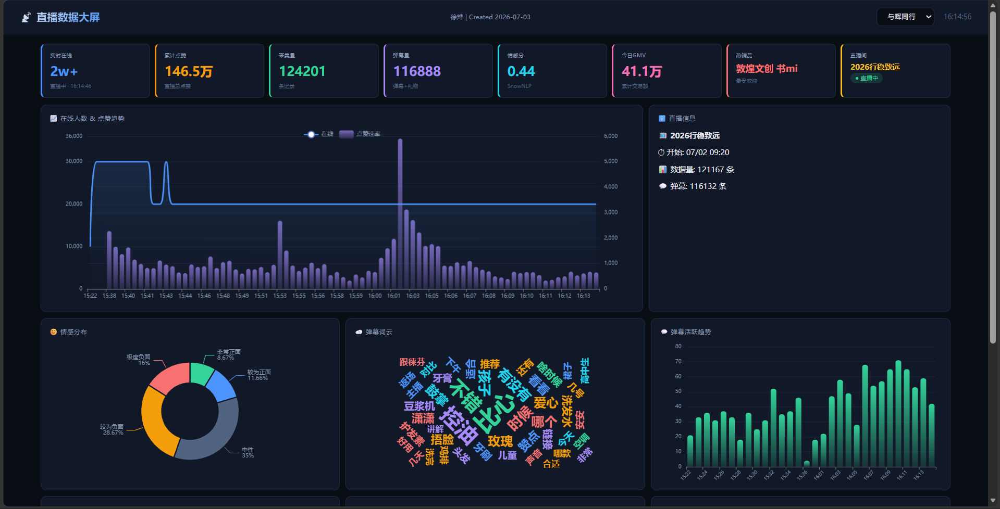
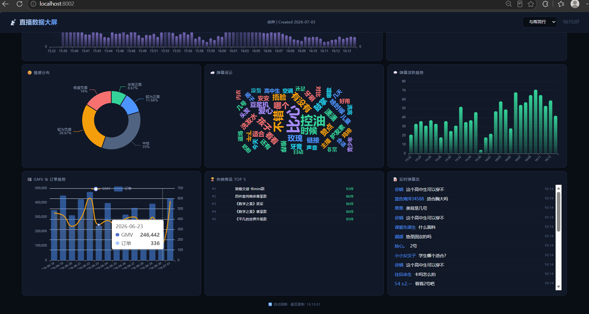
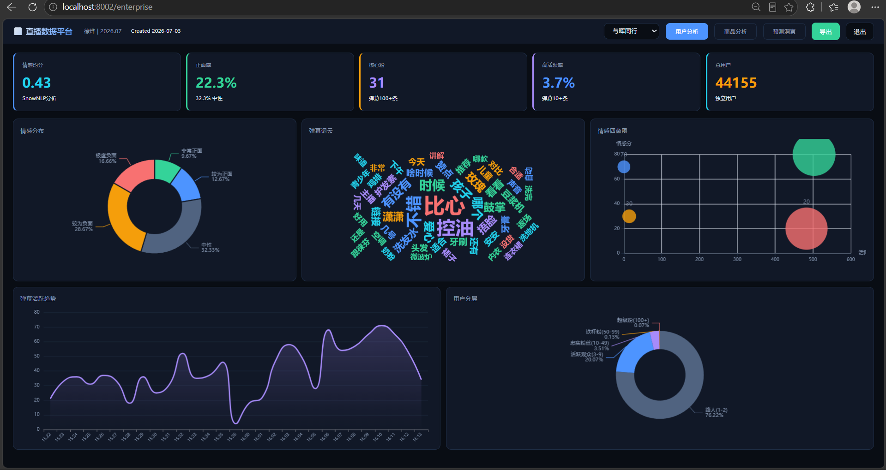
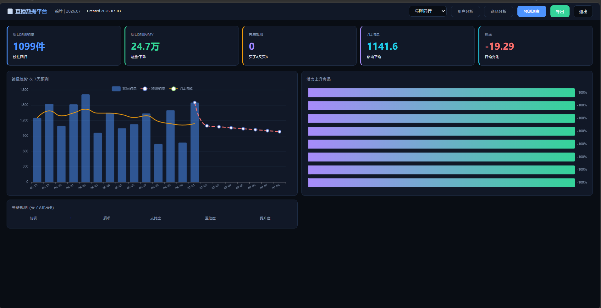
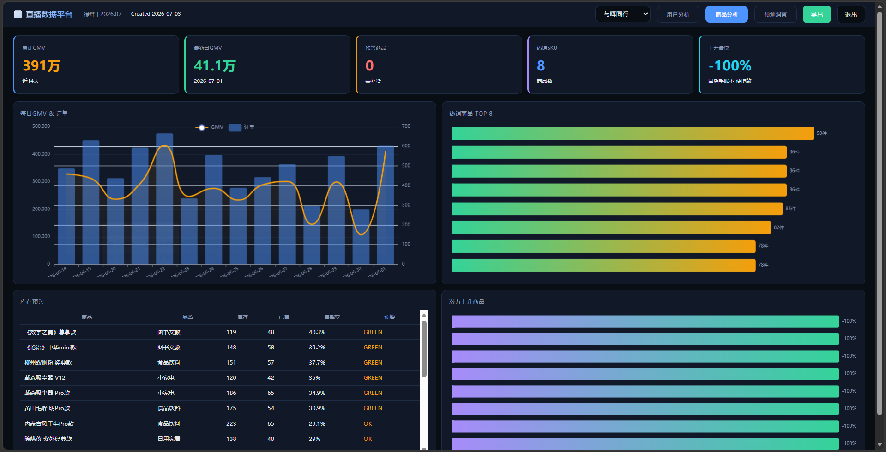

# 直播电商实时数据分析平台

大三生产实习项目。3台VM搭的Hadoop+Kafka+Flink+Hive集群，从抖音直播间实时采集数据，Flink SQL做窗口聚合，FastAPI做后端，ECharts做大屏。

## 技术栈

Kafka · Flink SQL 1.20 · Hive · Hadoop 3.5 · FastAPI · ECharts 5.5 · Python

## 跑起来的效果

**简易大屏** (`localhost:8002`) — 两个直播间的在线趋势、弹幕、GMV




**企业大屏** (`localhost:8002/enterprise`) — 3个标签页，10种图表，带JWT登录





## 数据怎么走的

```
抖音直播 (HTTP API + WebSocket)
  → Kafka (3个Topic, 3节点)
    → Flink SQL (Event Time + Watermark 5s + 1min TUMBLE窗口)
      → JDBC直写MySQL
    → kafka_to_mysql.py (备用管道, 也写MySQL)
      → FastAPI (30个接口)
        → ECharts大屏 (12s刷新)
```

另外还有一条离线链路：MySQL → HDFS → Hive 四层数仓 (ODS/DWD/DWS/ADS)。

## 项目结构

```
crawler/        数据采集 (HTTP轮询 + WebSocket长连接)
pipeline/       数据管道 (Kafka消费 + Hive ETL + 数据生成)
backend/        应用层 (FastAPI + NLP + 推荐 + 大屏HTML)
flink_jobs/     Flink SQL作业 (Event Time + TUMBLE窗口 + JDBC Sink)
sql/            Hive数仓建表DDL
scripts/        集群启动脚本
config.py       统一配置 (环境变量注入, 无硬编码密码)
```

## 怎么跑

前提：3台VM已配好Hadoop/Kafka/Flink/Hive/MySQL。

```bash
# 1. VM端启动集群
ssh hadoop01 "bash scripts/start_all.sh"

# 2. Windows端启动数据管道 (3个终端)
python crawler/douyin_full_crawler.py     # HTTP采集
python crawler/douyin_multi_room.py       # WebSocket弹幕采集
python pipeline/kafka_to_mysql.py         # Kafka消费入库

# 3. 启动后端
python backend/app.py

# 4. 打开浏览器
# http://localhost:8002          简易大屏
# http://localhost:8002/enterprise  企业大屏 (admin/admin123)
```

## Flink SQL作业

`flink_jobs/realtime_aggregation.sql` — 核心实时计算：

- 建表映射Kafka的`live_danmaku` topic
- Event Time取弹幕的`timestamp`字段，5秒Watermark处理乱序
- 1分钟TUMBLE窗口，按房间分组COUNT
- JDBC Sink直写MySQL `live_flink_metrics`表

踩过的主要坑：

1. **TO_TIMESTAMP不认ISO 8601的T分隔符** — 必须显式给格式串 `'yyyy-MM-dd''T''HH:mm:ss.SSSSSS'`
2. **MySQL远程权限** — TaskManager在别的节点连不上MySQL，需要`CREATE USER ... @'%'`
3. **pymysql的pyformat吃掉DATE_FORMAT的%** — 新增`db_query_raw`绕过参数替换

## 数据说明

- 房间指标和弹幕：从抖音两个直播间（影视飓风、与晖同行）实时采集，累计30万+条
- 商品和订单：Faker模拟生成（抖音不公开交易API，无法爬真实订单）
- `demo_proof.py` 可以验证弹幕数据的真实性

## 已知问题

- Flink SQL目前用Processing Time做窗口（Event Time+Watermark版本SQL已写好，但历史数据回放需要`scan.bounded.mode`配合，实时数据下直接可用）
- 商品/订单数据是模拟的
- 单文件HTML大屏可维护性差，后续考虑用Vue重构
